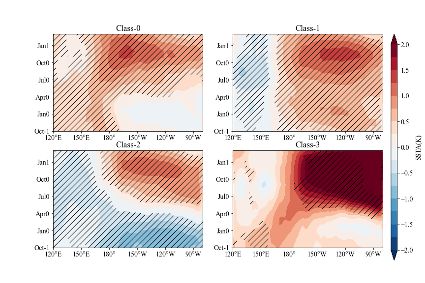
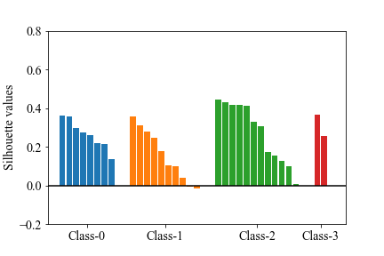

# 使用机器学习研究ENSO--复现一篇《PNAS》文章

原文：Historical change of El Niño properties sheds light on future changes of extreme El Niño

作者：Bin Wang\
DOI:10.1073/pnas.1911130116\
摘要（机翻）：人为变暖导致的厄尔尼诺强度变化对社会极为重要，但当前气候模型的预测在很大程度上仍不确定。目前对厄尔尼诺的分类没有区分强厄尔尼诺事件和中等厄尔尼诺事件，因此很难预测厄尔尼诺强度的未来变化。在这里，我们通过对开始和放大过程的聚类分析，对1901年至2017年的33次厄尔尼诺事件进行分类，由此产生的4种厄尔尼诺类型区分了强事件和中等事件，以及从连续事件开始的厄尔尼诺。厄尔尼诺发生的3类事件表现出不同的发展机制。我们发现，自20世纪70年代以来，厄尔尼诺开始的机制已经从东太平洋起源转变为西太平洋起源，极端事件的发生更加频繁。据推测，这种情势变化是由西太平洋背景变暖和赤道中太平洋相关的纬向和垂直海面温度梯度增加引起的，这揭示了一个可能导致未来极端厄尔尼诺事件增加的控制因素。耦合模式相互比较项目第5阶段（CMIP5）模型的预测表明，如果预测的中太平洋纬向SST梯度增强，强厄尔尼诺事件的频率和强度都将显著增加。如果目前观察到的背景变化在未来的人为强迫下继续，预计将出现更频繁的强厄尔尼诺事件。然而，这些模型在预测赤道纬向SST梯度方面的不确定性仍然是准确预测厄尔尼诺未来变化的主要障碍。

## 本文主要内容

本文主要集中于完成前期的K-Means聚类算法部分，主要语言为Python。

## 资料预处理

下载资料：原文所用的ERSSTV5与HadISST均可以通过搜索直接下载。\
其中ERSST为月资料数据，合并处理方法可以使用工具Cdo(Linux)进行处理，也可以参考我的上一篇复现《Nature》文章的xarray的合并方法(用Python从头到尾复现一篇Nature的工作 #1 数据下载及预处理 - Vector的文章 - 知乎
https://zhuanlan.zhihu.com/p/435606727).

        cdo cat *.nc out.nc !cdo处理方法
然后对两套资料进行插值为2x2的经纬度网格，既可以用cdo完成，也可以用xarray完成。cdo完成的代码：

        cdo remapbil,r180x90 in.nc out.nc

做完资料预处理后，就可以进行下一步的工作了。

## 获取所需的资料

我们使用Python完成接下来的步骤。用到xarray库。

```Python
import xarray as xr

data_path = "../DATA/"

# 选定所需的范围
hs = xr.open_dataset(data_path + "HadISST_sst_2x2.nc")['sst'].loc \
                ["1900":"2018", -5:5, 120:280]
es = xr.open_dataset(data_path + "ersstv5_1870-2019_2x2.nc")['sst'].loc \
                ["1900":"2018", 0, -5:5, 120:280]
# 经向平均
hs = hs.mean("lat")
es = es.mean("lat")

# 使用线性插值弥补空缺区域
es = es.interpolate_na(dim="lon", method="linear", fill_value="extrapolate")
hs = hs.interpolate_na(dim="lon", method="linear", fill_value="extrapolate")
# 同一时间，便于后面相加
hs['time'] = es['time']

# 求算数平均
hs_p_es = (hs + es) / 2.

# 求距平值
hs_p_es_a = hs_p_es.groupby("time.month") - hs_p_es.groupby("time.month").mean()

# 保存
eqsst = xr.Dataset({"ObsSST": hs_p_es_a})
eqsst.to_netcdf("./data/eqsst.nc")

```

## 获得El Nino年的数据

```Python
import xarray as xr
import matplotlib.pyplot as plt
import numpy as np

# 读取数据
eqsst = xr.open_dataset("./data/eqsst.nc")["ObsSST"]
# 计算Nino3.4指数
Nino34 = eqsst.loc[:, 190:240].mean("lon")
# 计算三月滑动平均
eqsst = eqsst.rolling(time=3, center=True).mean()
# 计算ONDJF的Nino3.4指数
Nino34ONIDJF = Nino34.rolling(time=5, center=True).mean().groupby("time.month")[12][:-1]
# 获得厄尔尼诺年
year = Nino34ONIDJF[Nino34ONIDJF >= 0.6].time.dt.year
print(year)
# 获得厄尔尼诺年用于计算和绘图的数据
draw_ls = []
cal_ls = []
for yr in np.array(year):
    time1 = "%s-10-01" % (yr - 1)
    time2 = "%s-10-30" % yr
    time22 = "%s-03-30" % (yr + 1)
    # 选取需要的数据
    dat_ssta = eqsst.loc[time1:time2]
    dr_ssta = eqsst.loc[time1:time22]
    draw_ls.append(np.array(dr_ssta)[np.newaxis, :])
    cal_ls.append(np.array(dat_ssta)[np.newaxis, :])
# 合并
draw_ls = np.concatenate(draw_ls, axis=0)
cal_ls = np.concatenate(cal_ls, axis=0)
print(draw_ls.shape, cal_ls.shape)
# 保存为nc文件
draw_xr = xr.DataArray(draw_ls, coords={"year": np.array(year), "month": np.arange(18), "lon": eqsst.lon})
cal_xr = xr.DataArray(cal_ls, coords={"year": np.array(year), "month": np.arange(13), "lon": eqsst.lon})
draw_ds = xr.Dataset({"ad_d": draw_xr})
cal_ds = xr.Dataset({"ad": cal_xr})
cal_ds.to_netcdf("./data/ad.nc")
draw_ds.to_netcdf("./data/ad_d.nc")
```

## 进行K-Means聚类

```Python
# %%
import xarray as xr
import numpy as np
import matplotlib.pyplot as plt

# 打开数据
ad = xr.open_dataset("./data/ad.nc")['ad']
ad_d = xr.open_dataset("./data/ad_d.nc")['ad_d']
ad.shape

# %%
time_label = ["Oct-1", "Jan0", "Apr0", "Jul0", "Oct0"]
time_label1 = ["Oct-1", "Jan0", "Apr0", "Jul0", "Oct0", "Jan1"]
from sklearn.cluster import KMeans
import scipy.stats as sts
from cartopy.mpl.ticker import LongitudeFormatter

# 使用K均值聚类
km_m = KMeans(n_clusters=clus, random_state=0).fit(np.array(ad).reshape(32,-1))
labels = km_m.labels_

# 开始绘图
plt.rc('font', family='Times New Roman', size=14)
xp, yp = np.array(ad.lon), np.arange(18)
clus = 4
ad_d1 = np.array(ad_d)
fig = plt.figure(figsize=(12, 8))
for clu in range(clus):

    add_clu = ad_d1[labels == clu]
    add_clu_mean = add_clu.mean(axis=0)
    # 统计检验
    p_v = sts.ttest_1samp(add_clu, np.zeros_like(add_clu_mean), axis=0).pvalue
    # 画图
    plt.subplot(2, 2, clu + 1)
    cm = plt.contourf(xp,
                      yp,
                      add_clu_mean,
                      cmap="RdBu_r",
                      levels=np.linspace(-2, 2, 17),
                      extend="both")
    plt.contourf(xp,
                 yp,
                 p_v,
                 hatches=['//', None],
                 colors="none",
                 levels=[0, 0.1, 1])
    plt.yticks(np.arange(0, 17, 3), time_label1)
    plt.xticks(xp[::15])
    plt.gca().xaxis.set_major_formatter(LongitudeFormatter())
    plt.title("Class-%s" % clu)
ax_cb = fig.add_axes([0.92, 0.08, 0.015, 0.80])
cb = fig.colorbar(cm,
                  cax=ax_cb,
                  orientation="vertical",
                  spacing="proportional")
cb.set_label("SSTA(K)")
# plt.tight_layout()
plt.savefig("./pic/k-means_re%s.png" % clus)
plt.show()

# 计算silhouette_score
from sklearn.metrics import silhouette_score, silhouette_samples

scores = silhouette_samples(np.array(ad).reshape(32,-1), labels=labels)
ini_len = 0
fig = plt.figure(figsize=[6, 4])
ticks = []
# 绘图
for clu in range(clus):

    score_clas = scores[labels == clu]
    xbar = np.arange(score_clas.shape[0]) + ini_len
    ini_len = xbar.max() + 3
    plt.bar(xbar, np.sort(score_clas)[::-1],width=0.85)
    tick = (xbar.min()+xbar.max())/2
    ticks.append(tick)
plt.ylim(-0.2, 1)
plt.xticks(ticks,["Class-%s"%i for i in range(clus)])
plt.axhline(y=0,color="black")
plt.xlim(-2,40)
plt.ylim(-0.2,0.8)
plt.ylabel("Silhouette values")
```
得到的结果:




可以看到得到的轮廓系数较低，我们后面进行了改进，提出了一种基于EOF的K-Means聚类方法，有兴趣的同学可以去Github上看一下。地址：https://github.com/zilumeng/PNAS-Kmeans-ENSO/blob/master/KM_method.ipynb


